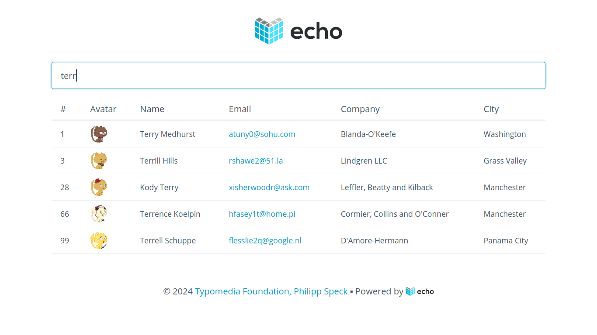

# Echo Demo Application

This is a simple application that demonstrates how to use the [Echo](https://echo.labstack.com/) web framework.

It fetches users from [dummyJSON](https://dummyjson.com/) and displays them in a table. 

## Technologies

- [Go](https://golang.org/)
- [Echo](https://echo.labstack.com/)
- [htmx](https://htmx.org/)
- [Pico](https://picocss.com/)
- [Air](https://github.com/cosmtrek/air)

## Run

    make run

## Build
    
    make build

## Cross compile

    make compile

## Screenshot

---
Copyright © 2024 Typomedia Foundation. All rights reserved.